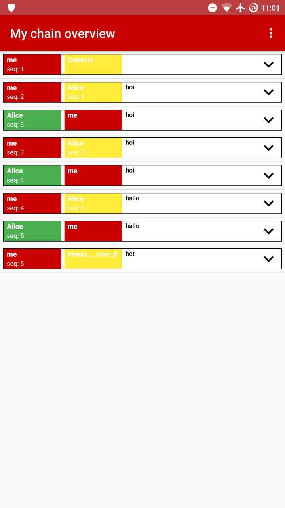
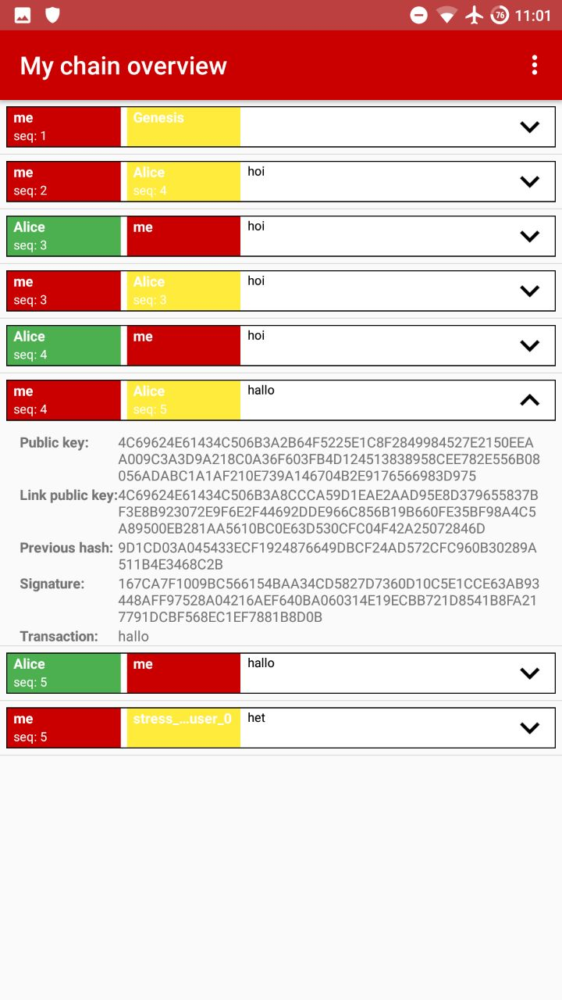
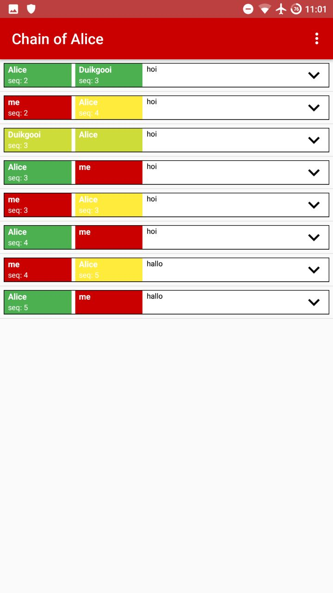
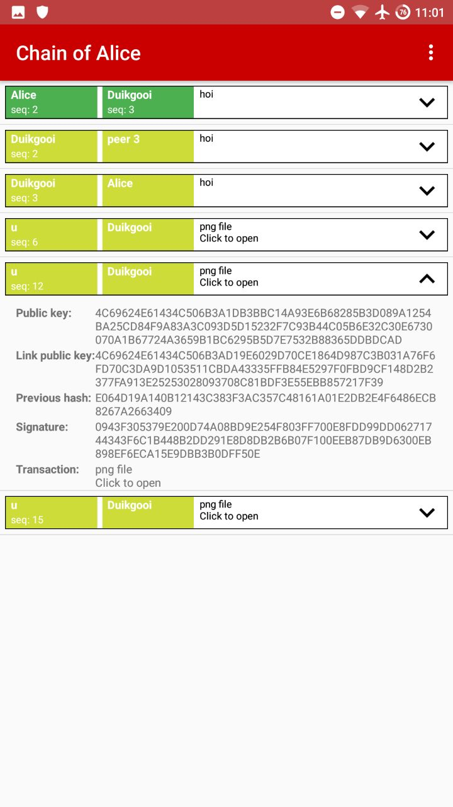

:: _chainexplorer:

******************
Chain Explorer
******************

The chain explorer has several functionalities:
- Show all (known) blocks in a chain
- Show the content of a block such as public key, link public key and the transaction
- Click on other public keys to expore other chains
- Open files from a block with a file

The left image shows all the block in the chain, the right image shows the content of block.

The left image shows the chain of a different user than the device owner, the right image shows a block which contains a file.

Viewing another chain can be done by clicking on the arrow on the right side of a block. This will expand the view and show information about the block as shown in Figure 2. If one of the public keys is pressed the chain explorer will load the chain of this public key as shown in Figure 3. Files can be openened by pressing the text 'Click to open' as shown in Figure 4.

*****************
Links to code
*****************
- `Chain explorere activity <https://github.com/klikooo/CS4160-trustchain-android/blob/develop/app/src/main/java/nl/tudelft/cs4160/trustchain_android/chainExplorer/ChainExplorerActivity.java>`_
- `Chain explorer adapter <https://github.com/klikooo/CS4160-trustchain-android/blob/develop/app/src/main/java/nl/tudelft/cs4160/trustchain_android/chainExplorer/ChainExplorerAdapter.java>`_ 

