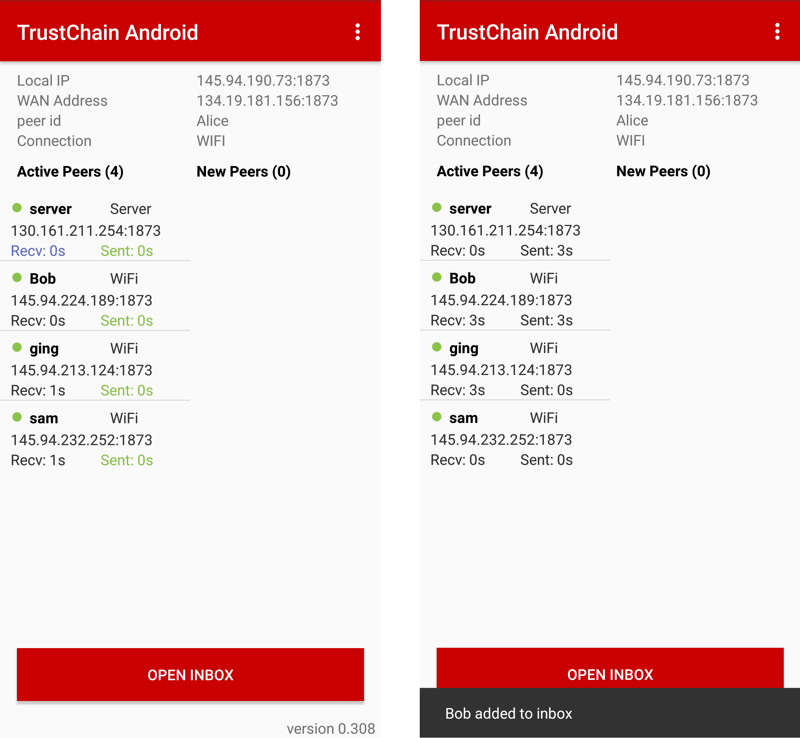
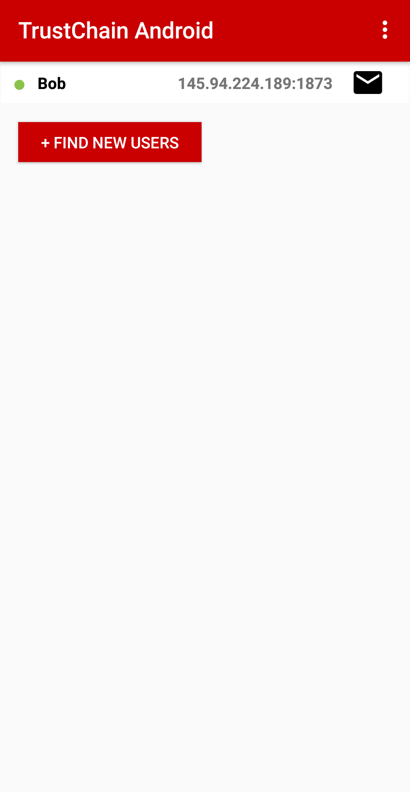
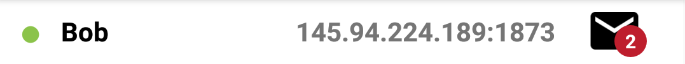
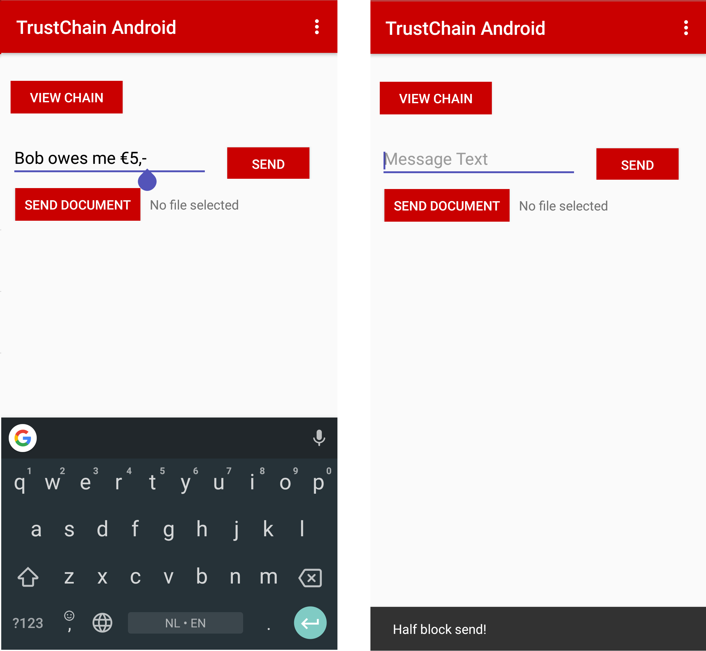
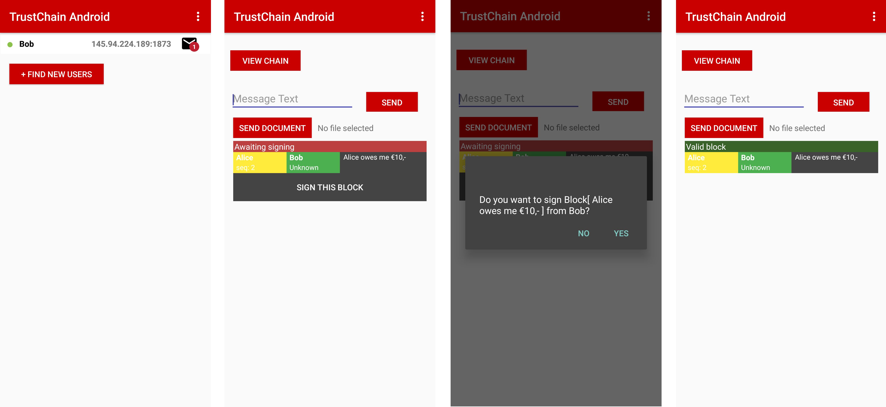

**************
Inbox
**************
The inbox is the place where you can interact with peers. The inbox gives an overview of all the peers that have sent blocks to you and you can add peers manually by clicking on them in the connection overview. When a peer is added to the inbox you can click on it to sign blocks sent to you, send new blocks, and inspect their chain using the :ref:`chainexplorer`.

===============
Why an inbox?
===============

In the first version of this app, it was only possible for the user to send/sign a block when they had a live connection with the peer that they wished to communicate with. The drawback of this design was that both the user and the peer needed to be online at the same time. This was cumbersome for the users, as they would have to tell each other to come online each time that they wanted to send a block to each other. With the inbox, no live connection is needed between users. All incoming blocks are stored locally and users can review them later at their convenience.

==============================
How does it work in the app?
==============================

In the main screen of the app, the user can add a peer to their inbox by clicking on an active peer. This is shown in :numref:`adding-peer`.

.. _adding-peer:

   
	Adding a peer to the inbox

After a peer has been added to the inbox, the user can open their inbox by clicking on the button that is located on the bottom of the screen. The user can see the peers that they have added to their inbox and the peers that have sent blocks. This is shown in :numref:`peer-inbox`.

.. _peer-inbox:

	Inbox of the user

Each peer in the inbox is displayed in a list item (see :numref:`inbox-item`) with the following properties:

* Colored circle, indicating peer status
* Peer username
* Peer IP address combined with port
* Mail icon with indicator if there are unread blocks

.. _inbox-item:

	Example inbox item

The user can then click on the peer to send a block as shown in :numref:`sending-block`.

.. _sending-block:

	Sending a block to a peer

The user can also see all the blocks that they have sent to a peer and blocks that they have received from a peer. The user can sign blocks that have been received as shown in :numref:`viewing-block-and-sign`.

.. _viewing-block-and-sign:

	Viewing received blocks and signing of a block

Links to code
=============
* :base-repo:`The inbox package <inbox>`

