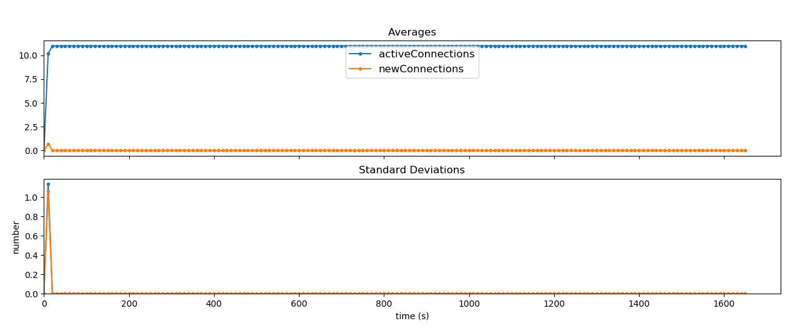
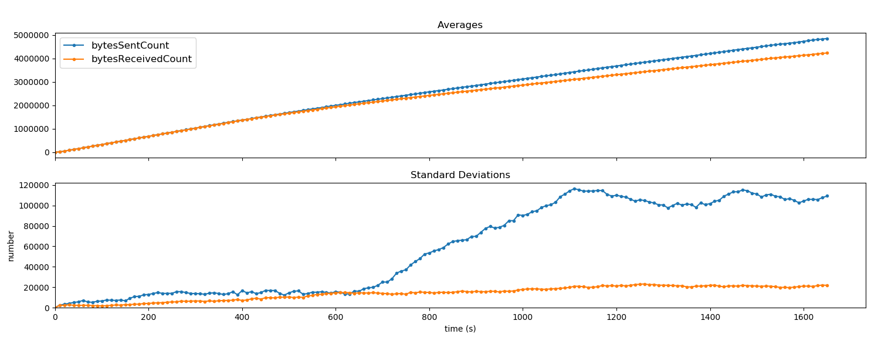
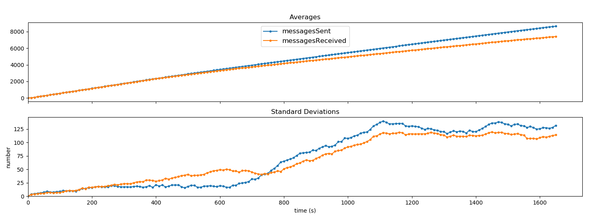
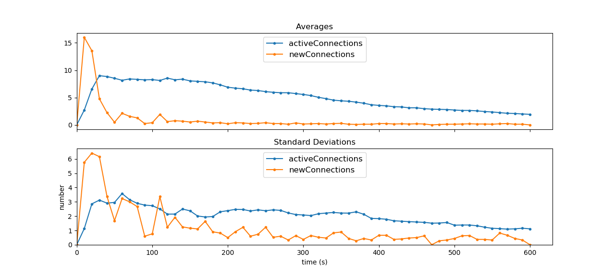
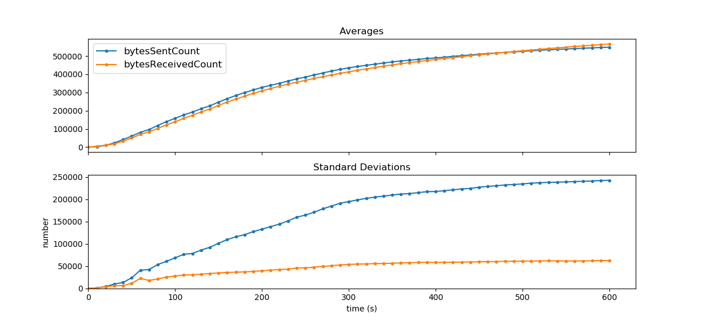
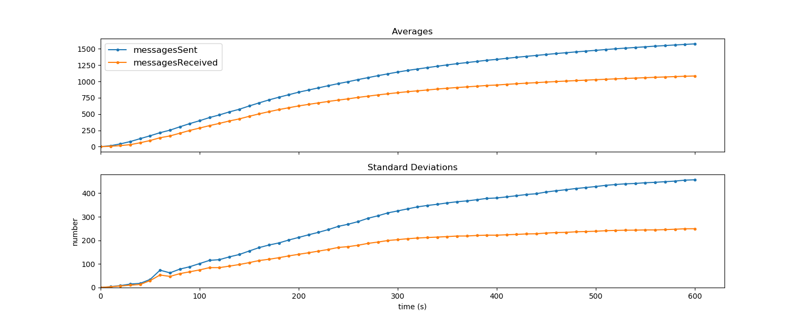
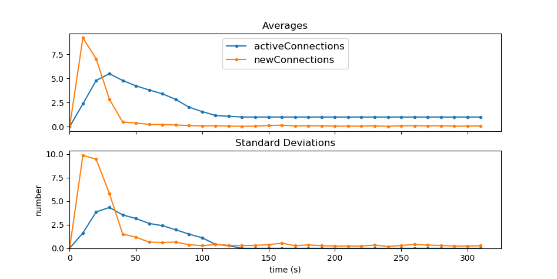
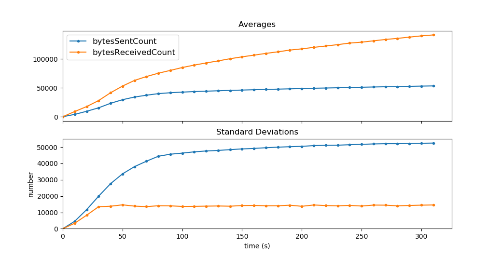
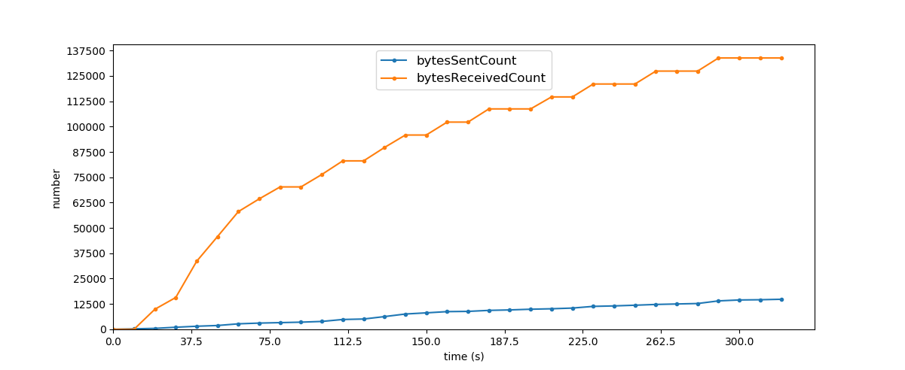

****************
Maturity of Code
****************
This project has had quite a few developers contributing to it. This has caused the codebase to become a mess in the past. After a few major refactors the codebase is much more structured now. This has the added advantage of easier identifying bugs and generally being much easier to understand. Because of the issues lined out in :ref:`code-coverage` and because writing tests for Android is generally quite time consuming. The code isn't automatically tested as well as would be desired. However, due to pull-based development the quality of the code and the operation of the app is tested by hand quite often by the developers.

So to put a label on it the code `(kinda) works <https://wiki.opencog.org/w/Code_Maturity_Guide>`_. It is definitely not production quality code, however it does work quite well and can demonstrate the possibilities on a small scale. The major bottleneck at the moment is the network overlay. While the TrustChain is scalable, the network overlay has some problems with scalability, limiting the scalability of the app. There are also some problems with the UI when the network is under load, as it can't update the network information.

Stress Test results
====================
Some stress tests were performed and the results will be listed below. These tests were performed at or around 27-07-2018. All done on a LG G4 phone. During the stress test the phone was connected by WiFi. Although it is important to note that most of the transmissions, i.e all except for the ones with the bootstrap server, are local, as all the peers are running on the same device.

10 peers
-----------
When 10 peers are started, the network is stable and fully connected, as shown in the graph below. Each node has an open connection to each other node and no connections are broken at any time.
This test was continued for about 1600 seconds, after which the LG G4 that ran the test decided that it really needed to turn off in order to protect its CPU from overheating.

When we look at the transmitted data, we see that after 10 minutes, on average each node has transmitted about 2 Megabytes of data.
After this point we see that the amount of sent data starts to grow more than the amount of received data, and the deviation of sent data between nodes increases.

If we compare that graph to the graph of the message count we see that it is very similar, as expected. A notable difference is that the deviation of the received messages does increase after 10 minutes, unlike the received data deviation. This may be result of a bug.

25 peers
---------
Increasing the amount of running nodes to 25 and running a stress test for 10 minutes generates the data shown in the graph below.
Running 25 nodes the network becomes less well connected, as the highest average number of connections tops at 9, and slowly decreases afterwards. The amount of new connections stays low on average, but the deviations graph, being erratic, suggests that at least some nodes are trying to reconnect.

The amount of sent and received data in this test is still very close to each other, as shown in the graph below.
When comparing that to the message amounts, we see very similar shapes in the graph, only showing that the amount of sent messages is greater than the amount of received ones. So on average, the receives messages must be somewhat larger than the sent ones.

50 peers
----------
If a test is started that runs 50 network nodes, we see that the network stagnates rather quickly. All connections break down and none of the nodes seem to ba able to keep an active connection.

If we then look at a graph showing the amount transmitted data, we see that when the connections drop off, there is still quite some data being received during the entire test, while the amount of average sent data per node grows a tiny bit but is mostly flat.
The graph below shows that while the amount of bytes received increases steadily, the deviation stays rather flat after half a minute, showing that all nodes are receiving data at a similar pace. Meanwhile the deviation on sent bytes is much higher, showing that some nodes are sending a lot more data than others.

The graph below shows the transmitted data during a 50 node stress test for one of the peers. This shows that first of all, indeed it is receiving a lot more than its sending, but also the receiving seems to happen in bursts of a lot of data being received for a while and then nothing being received for a while, each taking 10-20seconds.

Conclusion
-----------
When the network consists of a low number of peers, we have a fully connected graph of connections, and the network seems to be stable for at least the time the stress test was ran. However, when increasing the size of the network it becomes less stable and notably also less stable over time. As connections are lost they attempt to reconnect, but they don't seem to recover as quickly as they are broken.

A likely cause for this instability is simply the processing power of the phone performing the test, as the LG G4 used in this test seemed to have difficulty handling it all and got very hot over time. Notably the UI thread stopped responding completely even after running about 20 peers.

In order to get a clearer picture of the state of the network under load, it would help to run the stress test on an a phone that is more powerful. Additionally a stress test could be performed by multiple devices at the same time, distributing the load of running so many peers.

.. _code-coverage:

Code coverage
=============
It is quite hard to get a good idea of the code coverage for Android projects. This is due to the fact that there are two types of tests for Android. The instrumented (Android) tests and regular Unit tests. The instrumented tests are run on devices and emulators and can make use of the Android framework. Therefore they can be used to tests the UI and other parts which require a device. In our case the usage of the LibSodium cryptographic library requires us to run most cryptography related tests as an instrumented test, because the `library only get's loaded when the app is run on an actual device <https://github.com/joshjdevl/libsodium-jni/issues/95>`_. This is appears to be a bug/feature in Android. In some cases this can be solved by mocking the crypto related objects, however generally it severely limits the ability to write unit tests.

Unfortunately we haven't been able to get codecov to work with the AndroidTests, due to a combination of build errors and difficulties with getting AndroidTests to properly run on Travis. Therefore the codecov report below only reflects part of the coverage that can be done with unit tests. However, it must be said that adding the coverage of the AndroidTests wouldn't spectacularly increase the coverage.

.. _coverage-grid:
.. figure:: https://codecov.io/gh/klikooo/CS4160-trustchain-android/branch/master/graphs/tree.svg
	:width: 400px
	:alt: Coverage Grid

	Coverage Grid, click on the grid (external link) and hover on a block to see which file it is

=========================	=====	===	=======	======	========
Files                    	lines	hit	partial	missed	coverage
=========================	=====	===	=======	======	========
block                    	218  	65	4      	149   	29.82%
chainExplorer            	165  	0	0      	165   	0.00%
crypto                   	106  	0	0      	106   	0.00%
funds                    	323  	0	0      	323   	0.00%
inbox                    	117  	17	3      	97    	14.53%
main                     	462  	5	0      	457   	1.08%
network                  	267  	0	0      	267   	0.00%
offline                  	316  	0	0      	316   	0.00%
passport                 	979  	80	6      	893   	8.17%
peer                     	203  	55	6      	142   	27.09%
peersummary              	289  	0	0      	289   	0.00%
storage                  	291  	0	0      	291   	0.00%
util                    	208  	69	4      	135   	33.17%
message/MessageProto.java	3,637	207	64     	3,366 	5.69%
Project Totals (70 files)	7,581	498	87     	6,996 	6.57%
=========================	=====	===	=======	======	========

Latest coverage table can be found at `codecov <https://codecov.io/gh/klikooo/CS4160-trustchain-android/tree/master/app/src/main/java/nl/tudelft/cs4160/trustchain_android>`_
