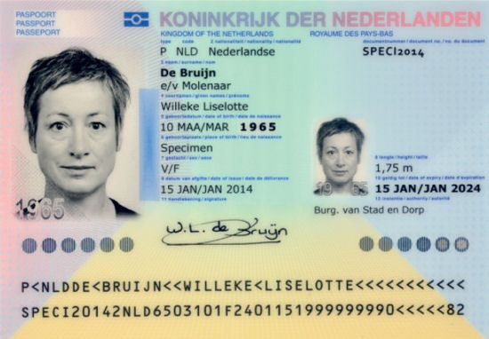
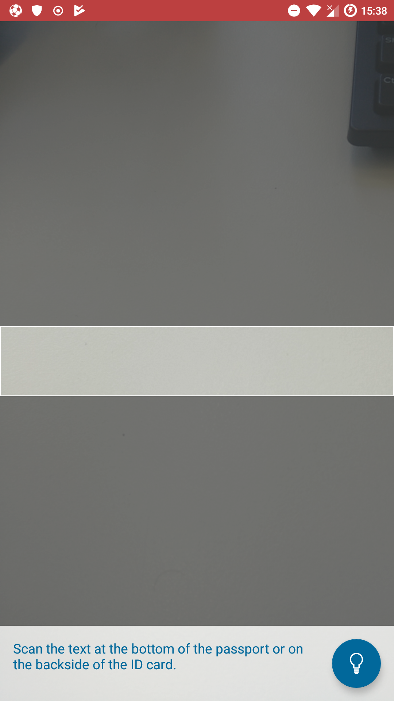

******************************
Passport
******************************

Every Dutch passport contains a RF chip which contains personal data of the passport holder, such as name, address, date of birth and a photo. Next to these, the chip is equipped with an unique private-public keypair and is able to sign an array of eight bytes long. Such a signature can be used to verify the authenticity of a passport, which is called Active Authentication (AA). To prevent that the chip can be read by anyone without physical access, some access control measures are implemented in the passport. There are two levels of access control, Basic Acces Control (BAC) and Extended Access Control (EAC), each allow for different permissions on what can be read from the passport.

In order to perform BAC the name, date of birth and the BSN should be sent to the passport and the passport will verify if these are correct and will provide access to the AA and other personal data correspondingly. The data necessary for BAC could be entered manually or via OCR by reading the Machine Readable Zone (MRZ). The MRZ is the text at the bottom (which starts with P<NLD) in the figure shown below. The MRZ contains all data that is needed for BAC and contains some additional data to ensure that the MRZ was read correctly by OCR (checksums).

EAC gives more privileges as BAC. With these privileges biometrics can be read from the passport, such as the fingerprint from the passport holder. However, to gain access to the biometrics the government has to supply a private key, which is only supplied to trusted parties.

===============
Implementation
===============
A connection with the passport is setup by the open source library `jMRTD <https://jmrtd.org/>`_. The logic for opening the connection, performing BAC and AA are mainly implemented in the class PassportConnection, which is used by the class PassportConActivity. Reading the MRZ can be done in two different ways: OCR or manual input.
The library that is used for OCR is called Tessarect. The package ocr (in the passport package) is responsible for handling all OCR related work, such as opening the camera and providing images to perform OCR.
The class ManualInputActivity is responsible for handling the manual input of data for BAC. The ManualInputActivity can only be reached from the CameraActivity and when no MRZ has been successfully read by the OCR.

.. figure:: ./images/passport/PassportConActivity.jpg
   :width: 48%
   :alt: Fig. 3. PassportConActivity

The data of a passport holder is passed around via intents. The DocumentData class contains the data to perform BAC and is passed from either the CameraActivity or the ManualInputActivity to the PassportConActivity.

